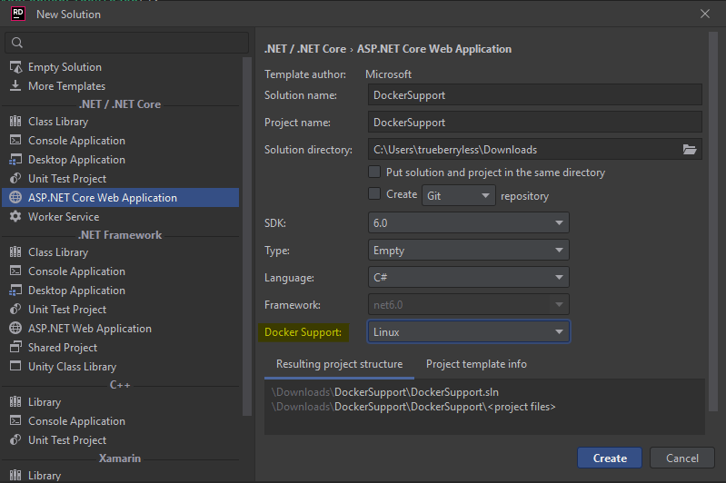
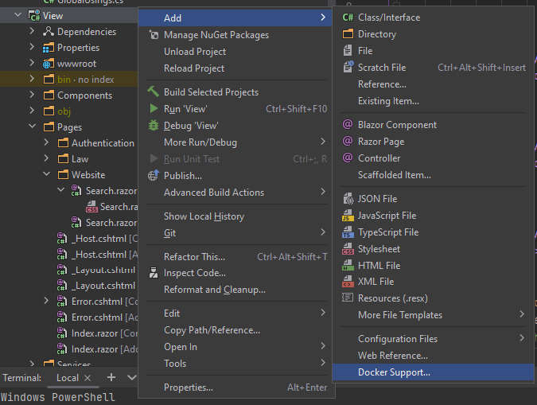
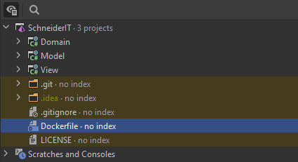

# Add Dockerfile

You have to options to let JetBrains Rider autogenerate your Dockerfile:

-   The first option is only possible during solution creation:

    

-   The second option can also be done afterwards. Therefore, you need to right click your project, select "**Add**" ➜ "**Docker Support**" ➜ "**Target OS: Linux**"

    

# Move Dockerfile

The first thing you want to do when you have multiple projects which should be dockerized together is moving the Dockerfile out of the specific project. Just paste it in the root folder of the solution, like shown in the screenshot:



> If Rider doesn't show these files click on the Eye-Icon in the top left corner of the screenshot.

# Edit Dockerfile

Next, you want your Dockerfile to look something like this:

```Dockerfile
FROM mcr.microsoft.com/dotnet/aspnet:7.0 AS base
WORKDIR /app
EXPOSE 80
EXPOSE 443

FROM mcr.microsoft.com/dotnet/sdk:7.0 AS build
WORKDIR /src
COPY ["View/View.csproj", "View/"]
COPY ["Domain/Domain.csproj", "Domain/"]
COPY ["Model/Model.csproj", "Model/"]
RUN dotnet restore "View/View.csproj"
COPY . .
WORKDIR "/src/View"
RUN dotnet build "View.csproj" -c Release -o /app/build

FROM build AS publish
RUN dotnet publish "View.csproj" -c Release -o /app/publish

FROM base AS final
WORKDIR /app
COPY --from=publish /app/publish .
ENTRYPOINT ["dotnet", "View.dll"]
```

> You want to copy all your projects which depend on each other and then run the project which has a executable file, like Program.cs.

# Build the docker image

Open some kind of terminal, go to the root folder of your solution (the same path where your Dockerfile lives) and run the following command:

```powershell
docker build -t tagname .
```

> Of course, you can change the tagname. For example, you could just name the tag **latest** so that Docker Hub supports instant running containers without specifying the tag.

# Create docker-compose.yml

If your project has other projects as dependencies which should run in the docker container too, you should create a docker-compose.yml file which configures services, volumns, ... for a docker container.

In our example, we want to run a MySQL DB and the application itself. Notice how the _healthcheck_ and the _depends_on_ are just there to guarentee that the DB runs before the application starts.

```yml
services:
    db:
        image: mysql:8.0.27
        networks:
            - db
        environment:
            MYSQL_ROOT_PASSWORD: "ultrastrong"
        healthcheck:
            test: "exit 0"

    trainit:
        image: trueberryless/trainit
        ports:
            - "80:80"
        networks:
            - db
        depends_on:
            db:
                condition: service_healthy

networks:
    db: {}
```

# Run the docker container

Now just open a terminal with the correct path and run:

```powershell
docker-compose up
```
